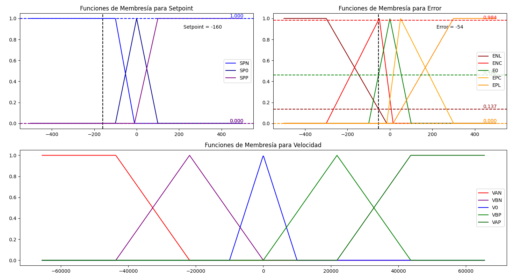

# FuzzyLib
FuzzyLib es una librería que incorpora lógica difusa en CircuitPython. Una de las principales ventajas de utilizar CircuitPython es la inclusión de la biblioteca Ulab con Numpy, lo que nos permite manipular vectores sin utilizar memoria a compración de los arreglos y listas.

## Fuzzy Logic

Para ilustrar visualmente cómo opera la lógica difusa en FuzzyLib, consideremos un ejemplo de control de posición de motor.
En primer lugar, es necesario definir las variables a fuzzificar, que en este caso son el setpoint y el error de posición.
Posteriormente, debemos establecer los universos y las funciones de membresía de estas variables. En el código, esta definición se realiza de la siguiente manera:

```python
import ulab.numpy as np

# Definir Universos de entrada (setpoint y setpoint) y salida (datacycle)
sp = np.array([-500, 500])
e = np.array([-500, 500])
v = np.array([-65535, 65535])

# Definir las funciones de membresía de entrada
SPN = np.array([-500, -500, -60, -10])  # Setpoint Negativo
SP0 = np.array([-500, 0, 500])          # Setpoint Cero
SPP = np.array([-100, 30, 45, 500])     # Setpoint Positivo

SP = [SPN, SP0, SPP]

ENL = np.array([-500, -500, -300, -15])  # Error Negativo Lejano
ENC = np.array([-100, -50, 0])           # Error Negativo Cercano
E0 = np.array([-40, 0, 40])              # Error Cero
EPC = np.array([-15, 50, 200])           # Error Positivo Cercano
EPL = np.array([15, 300, 500, 500])      # Error Positivo Lejano

E = [ENL, ENC, E0, EPC, EPL]

# Definir las funciones de membresía de salida
VAN = np.array([-65535, -65535, -43690, -21845])   # Velocidad Alta Negativa
VBN = np.array([-43690, -21845, 0])                # Velocidad Baja Negativa
V0 = np.array([-21845, -10000, 10000, 21845])      # Velocidad Cero
VBP = np.array([0, 21845, 43690])                  # Velocidad Baja Negativa
VAP = np.array([21845, 43690, 65535, 65535])       # Velocidad Alta Positiva

V = [VAN, VBN, V0, VBP, VAP]
```




