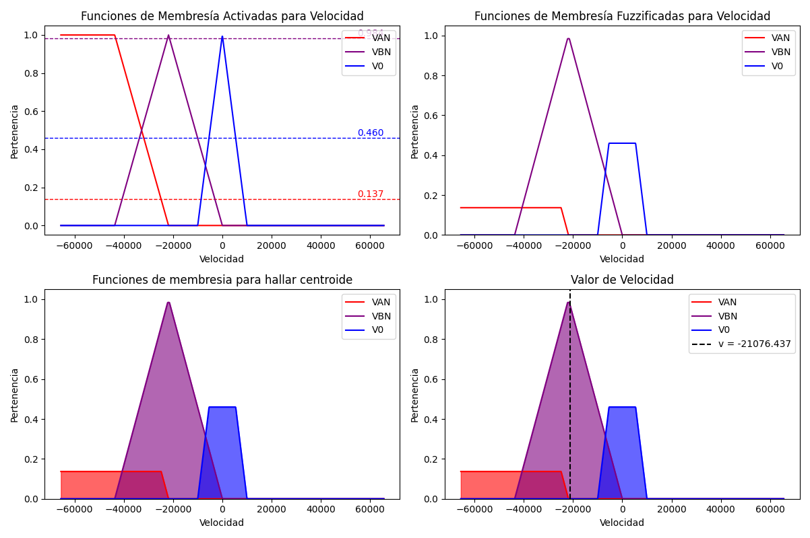

# FuzzyLib
FuzzyLib es una librería que incorpora lógica difusa en CircuitPython. Una de las principales ventajas de utilizar CircuitPython es la inclusión de la biblioteca Ulab con Numpy, lo que nos permite manipular vectores sin utilizar memoria a compración de los arreglos y listas.

## Fuzzy Logic

Para ilustrar visualmente cómo opera la lógica difusa en FuzzyLib, consideremos un ejemplo de control de posición de motor.
En primer lugar, es necesario definir las variables a fuzzificar, que en este caso son el setpoint y el error de posición.
Posteriormente, debemos establecer los universos y las funciones de membresía de estas variables. En el código, esta definición se realiza de la siguiente manera:

```python
import ulab.numpy as np

# Definir Universos de entrada (setpoint y setpoint) y salida (datacycle)
sp = np.array([-500, 500])
e = np.array([-500, 500])
v = np.array([-65535, 65535])

# Definir las funciones de membresía de entrada
SPN = np.array([-500, -500, -60, -10])  # Setpoint Negativo
SP0 = np.array([-500, 0, 500])          # Setpoint Cero
SPP = np.array([-100, 30, 45, 500])     # Setpoint Positivo

SP = [SPN, SP0, SPP]

ENA = np.array([-500, -500, -300, -15])  # Error Negativo Alto
ENB = np.array([-100, -50, 0])           # Error Negativo Bajo
E0 = np.array([-40, 0, 40])              # Error Cero
EPB = np.array([-15, 50, 200])           # Error Positivo Bajo
EPA = np.array([15, 300, 500, 500])      # Error Positivo Alto

E = [ENL, ENC, E0, EPC, EPL]

# Definir las funciones de membresía de salida
VAN = np.array([-65535, -65535, -43690, -21845])   # Velocidad Alta Negativa
VBN = np.array([-43690, -21845, 0])                # Velocidad Baja Negativa
V0 = np.array([-21845, -10000, 10000, 21845])      # Velocidad Cero
VBP = np.array([0, 21845, 43690])                  # Velocidad Baja Negativa
VAP = np.array([21845, 43690, 65535, 65535])       # Velocidad Alta Positiva

V = [VAN, VBN, V0, VBP, VAP]
```


Si utilizaramos listas y arreglos, utilizando la funcion gc.mem_free() nos sale que consume una memoria de 848 bytes. Con Ulab Numpy, se consume 576 bytes.

Luego, se tienen que definir las Reglas Difusas. La forma de declarar las Reglas Difusas dependerá de la versión de la librería. En la versión 1.0, la forma de declarar era mediante esta matriz:

```python
R = [[SPN, ENA, VAN],
     [SPN, ENB, VBN],
     [SPN, E0, V0],
     [SPN, EPB, VBP],
     [SPN, EPA, VAP],
     [SP0, ENA, VAN],
     [SP0, ENB, VBN],
     [SP0, E0, V0],
     [SP0, EPB, VBP],
     [SP0, EPA, VAP],
     [SPP, ENA, VAN],
     [SPP, ENB, VBN],
     [SPP, E0, V0],
     [SPP, EPB, VBP],
     [SPP, EPA, VAP]]
```
La interpretación de esta matriz es que cada regla difusa se aplica por fila. Ejemplo:

Si el Setpoint es *Negativo* y el Error es "Negativo Alto", entonces la Velocidad es "Alta Negativa".
Si el Setpoint es *Positivo* y el Error es "Negativo Corto", entonces la Velocidad es "Baja Negativa".

Cabe recalcar que en esta versión solo se podia utilizar el operador "and". Con las actualizaciones, más operadores se va agregando, revisar la ocumentación en este repositorio.

Por último, se aplica las reglas difusas a cada entrada. El resultado es una combinación de trapecios en la salida. Fuzzy Lib identifica los valores fuzzificados de la salida y lo defuzzifica por el método de centroide para obtener el valor final de la salida.



Ya con la idea de cómo funciona La lógica Difusa en FuzzyLib, te invito a revisar la documentación sobre las versiones.
